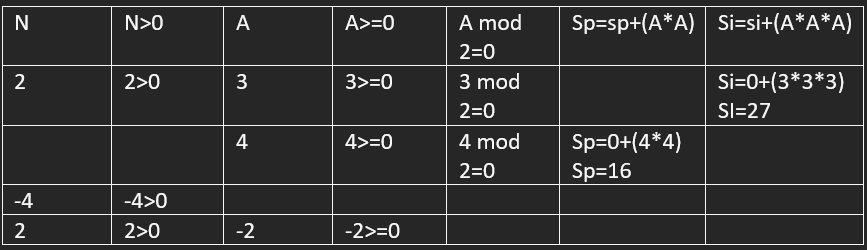

Problema: capture n numeros enteros positivos, la suma del cuadrado de los pares y el cubo de los impares.

analisis:

1. Inicio
2. indique cuantos numeros son
3. validar que sea mayor a cero
4. ingresa numero
5. validar que numero se >=0
6. si numero es par se va sacar el cuadrado de ese numero y si es impar el cubo de el
7. contar 
8. hacer un ciclo para q se repita las veces que el usuario indique
9. imprimir suma de los pare y suma de los impares
10. Fin

| c=0            | sp=0            | si=0           |
|----------------|----------------|
| Row 1 Column 1 | Row 1 Column 2 |

